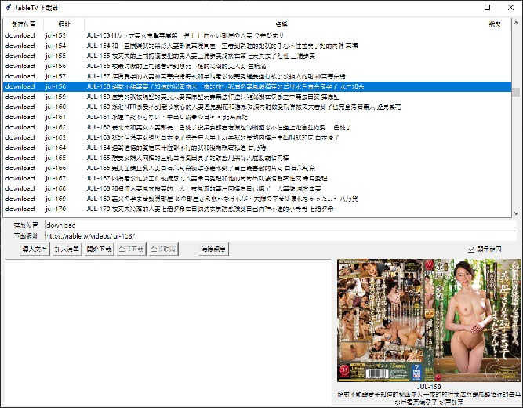

# JableTVDownload(改圖形介面)
### 源碼來源 : hcjohn463/JableDownload
舊版命令列使用說明，請參考來源 hcjohn463/JableDownload
### 目錄dist底下有Windows版可執行檔，可不須安裝Python，直接執行。
## 下載JableTV好幫手
每次看正要爽的時候就給我卡住轉圈圈  
直接下載到電腦看沒煩惱

### 圖形介面版功能
* 將下載預估時間，改成：(花費時間) / (已下載文件) * (未下載文件)
* 增加儲存位置，可指定下載後儲存的位置。
* 增加下載圖片。
* 下載後檔名為該網頁之標題。
* 增加網址表列可加入蒐集的網址。(儲存文件為 jabletv.cvs )
* 可載入文字檔。檔案內有JableTV相關網址時，會自動加入列表。
* 剪貼簿裡有JableTV相關網址時，會自動加入列表。
* 可以複選多個網址，一鍵全部下載。
* 單線下載。前一個網址下載完成或取消，才會開始下載下個網址。
* 可繼續下載已取消的下載項目。
* 單選或複選多個網址後，按Delete可以刪除。
* 可以預覽圖片。可選擇是否開啟預覽。

### requirements
`pip install -r requirements.txt`

### 執行程式(Execute)
命令列版 `python main.py -nogui True`

圖形介面版 `python main.py`

Windows版  `dist\main.exe`

